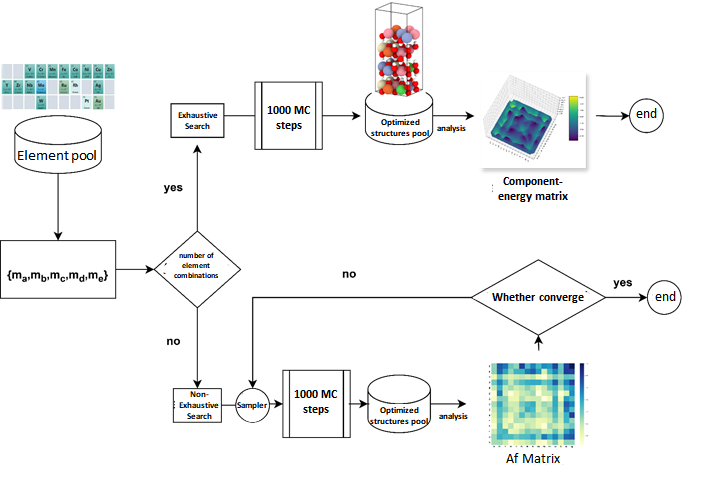
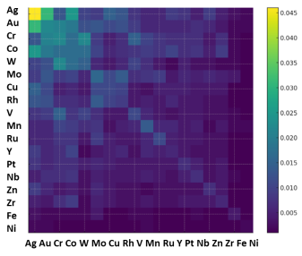

# INTRODUCTION

This code serves as the starting point for the high-throughput screening of high-entropy materials. Within the element pool (a collection of candidate elements), under a given crystal structure, element combinations more likely to form high-entropy materials are selected through the calculation of formation energy ($\Delta E_f$) and elemental pair affinity potential ($A_f$).

# THEORY
1.Monte Carlo Algorithm

As an energy-based screening method, this section employs the Monte Carlo simulation, where atoms are continuously swapped. The decision to accept a swap is made using the Metropolis algorithm, aiming for an optimized composition.

2.Calculation of Formation Energy

Once the composition and energy of the optimized structure are known, the formation energy, or $\Delta E_f$, can be calculated for comparing the structural stability under different compositions. The formation energy is defined as:

$\Delta E_f = E_{tot} - \Sigma_i E_{m_i}^{vac} \quad （1）$

where $E_{tot}$ represents the total energy calculated by the Machine Learning Potential (MLP), and $E_{m_i}^{vac}$ is the energy of the metal atom $m_i$ in a vacuum.

3.Calculation of Elemental Coordination Affinity Potential

The elemental coordination affinity potential, $A_f$, is defined as:

$A_f^{ij} = n[bond_{ij}]/(n_{mi}*n_{mj}) \quad （2）$

where $E_{tot}$ represents the total energy calculated by the Machine Learning Potential (MLP), and $E_{m_i}^{vac}$ is the energy of the metal atom $m_i$ in a vacuum.

4.Comprehensive Calculation of Affinity Potential for Large Element Combinations (non-Exaustive_search )

When the number of possible element combinations is small, energy for all compositions can be calculated exhaustively. However, when the potential combinations become numerous (reaching into the thousands), the computational demand of direct Monte Carlo simulations becomes excessively high. At this point, alternative methods are needed to obtain an overall distribution of coordination. The affinity potential used in this study is based on the assumption that the bond energy of elements is primarily determined by the elements forming the chemical bond, with other elements playing a secondary role in determining bond strength. Moreover, the probability of coordination is directly related to the bond energy (Boltzmann distribution). Therefore, to compare the affinity potentials of two elements that do not simultaneously appear in a compound, one only needs to calculate their ratio with respect to some element pair that does appear together.

Thus, the approach involves extracting several potential element combinations, calculating their independent ${A_f^i}$ values, where $\Sigma_i$ is the total number of samples drawn, and then using matrix assembly techniques to connect each ${A_f^i}$ and form a comprehensive $A_f$ encompassing all elements. When the number of samples is sufficient to keep $A_f$ stable without significant changes as the sample size increases, the system is considered to have converged and further calculations can be ceased. As a reference, it has been observed in practice that for combinations of 5 out of 18 elements, convergence is achieved after about 2000-3000 iterations.

#  FLOWCHART 

#  USAGE
Currently, there is no automatic method developed for distinguishing between Exhaustive_search and non-Exhaustive_search. One must manually use either Exhaustive_search or non-Exhaustive_search.

For Exhaustive_search:

It involves categorizing elements into primary elements listed under main_ele and permissible variant elements listed under element_pool.
The elemental structural framework is represented by blank.cif, which should be written using the element Ni.

./main.sh

For non-Exhaustive_search:
(1) Enter the directory non-Exhaustive_search/01.mc0.

Replace blank.cif, which serves as the elemental framework, with a specific elemental framework.
Modify input.parameters where:
f_str is the filename of the elemental framework;
elements_pool is the pool of elements allowed for transformation;
f_dp is the dp force field file;
nelement_chose specifies the number of elements in the high entropy materials;
P_list indicates their occurrence frequency;
work_dir is the execution location;
n_loop_time is the loop time;
opt_script is the shell script for executing lammps MC.
Execute the process using:

./main.py

(2) After completing the first step, proceed to directory 02.Af0 and execute:

./main.sh

This will create a directory named xyz_files containing the file final_Af_matrix.txt. Use the data in this file to plot the Af matrix.

#  EXAMPLE

An example output using this code. The graph represents an analysis of the coordination preferences of 18 elements in an FCC (face-centered cubic) structure. The brighter the color, the higher the affinity. Combinations of elements with similar affinities are more likely to form high entropy alloys.
